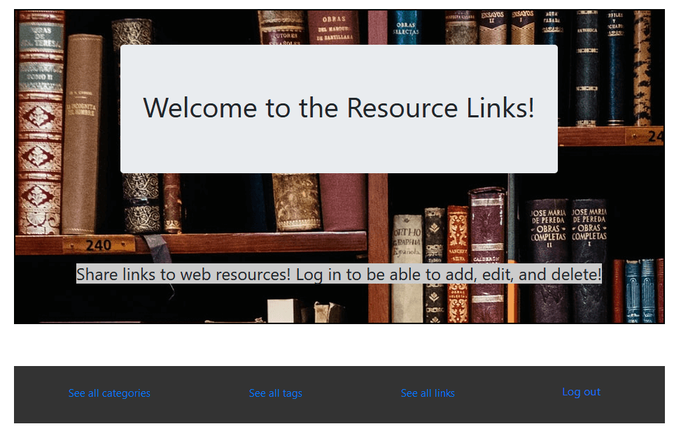
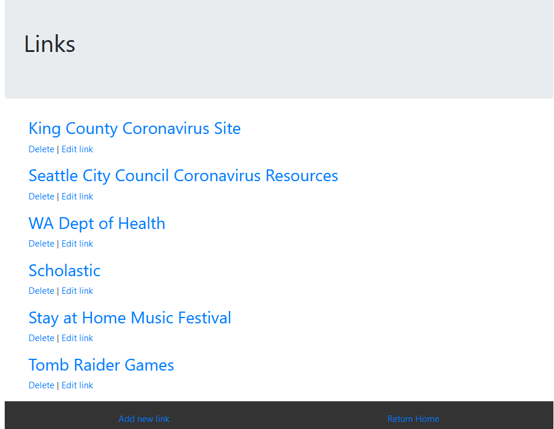
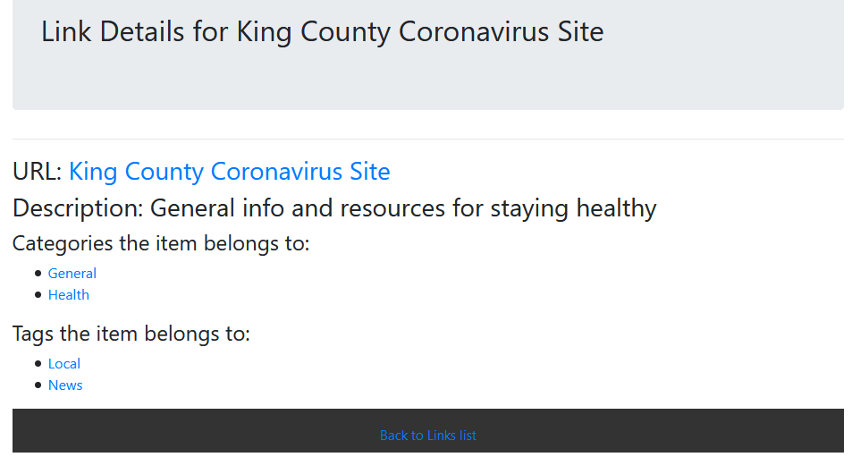
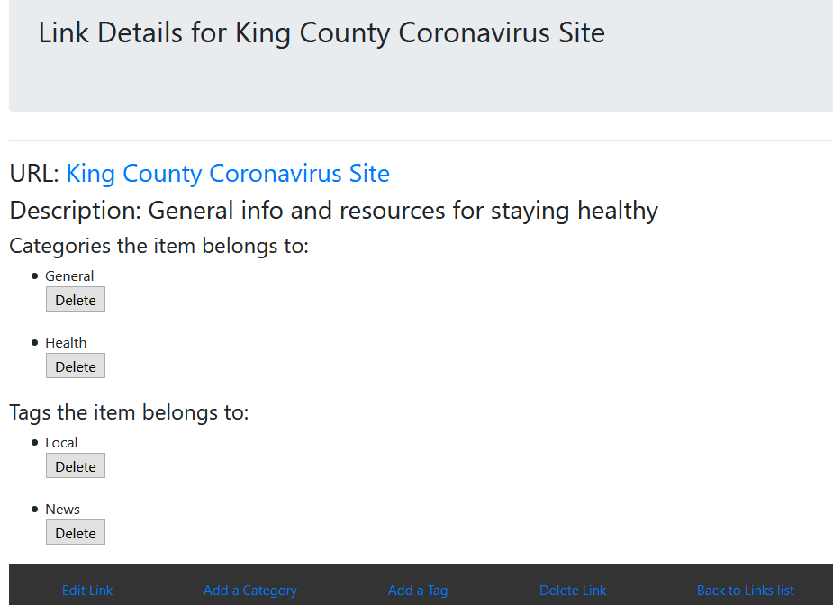

# _[Resource Links](https://github.com/TSiu88/ResourceLinks)_

#### _Brief desc of Project, 03.24.2020_

#### By _**Tiffany Siu and Andriy Veremyeyev**_

---
## Table of Contents
1. [Description](#description)
2. [Setup/Installation Requirements](#setup/installation-requirements)
    - [Requirements to Run](#requirements-to-run)
    - [Instructions](#instructions)
    - [Other Technologies Used](#other-technologies-used)
3. [Notable Features](#notable-features)
4. [Specifications](#specifications)
5. [User Stories](#user-stories)
6. [Screenshots](#screenshots)
7. [Known Bugs](#known-bugs)
8. [Support and Contact Details](#support-and-contact-details)
9. [License](#license)
---
## Description
This application allows someone to be able to add and share resources that are important for the current situation of the Coronavirus Outbreak or any other situation where sharing a large amount of resource links.  This application will consolidate links to be viewable in one place and allows adding categories or tags to the links.  Links are visible for everyone but can only be added, edited, or deleted with a login.

#### 3/25/20 Work from Home Summary
- Resource Links
  - Fix functionality which was not working properly
  - Add messages for duplicate categories/tags or prevent ability to add duplicates
  - Add authorization to edit but ability to view without login
- Struggles:
  - Showing error message for duplicate on same view without creating a new view
  - Editing existing category/tag into a duplicate of another existing category/tag

#### 3/24/20 Work from Home Summary
- University Registrar
  - Add password authorization
- Resource Links
  - Design project to be applicable for recent events
  - Able to apply project to any other resource link sharing
- Career Services Presentation on CVs/Cover Letters/Resumes
- Struggles:
  - Many-to-many relationships creating multiple relationship with checkboxes
  - Checkboxes being enabled and interactable with HTML helpers and passing it into the controller

<!-- #### Notes

##### Parking Lot
- Create link entries w/ multiple tags/categories from checkboxes
- View link list by category or by tag
- Search 
 -->

## Setup/Installation Requirements

_This program requires .NET Core SDK to run. [Here is a free tutorial](https://www.learnhowtoprogram.com/c-and-net/getting-started-with-c/installing-c-and-net) for installing .NET on Mac or Windows 10 from the [official website](https://dotnet.microsoft.com/download/dotnet-core/)._ 

_This program also makes use of SQL databases. We recommend using MySQL Workbench to build your databases. [Here is a free tutorial](https://www.learnhowtoprogram.com/c-and-net/getting-started-with-c/installing-and-configuring-mysql) for installing MySQL WorkBench and MySQL Community Server on Mac (using links [Mac1](https://dev.mysql.com/downloads/file/?id=484914) and [Mac2](https://dev.mysql.com/downloads/file/?id=484391)) or [Windows 10](https://dev.mysql.com/downloads/file/?id=484919)._

### Requirements to Run
* _.NET Core_
* _ASP.NET Core MVC_
* _MySQL Workbench_
* _MySQL Community Server_
* _Entity Framework_
* _Command Prompt_
* _Web Browser_

### Instructions

*This application may be viewed by:*

1. Download and install .NET Core from the [official website](https://dotnet.microsoft.com/download/dotnet-core/)
2. Download and install MySQL Workbench and Community Server for Mac or Windows by following the instructions [here](https://www.learnhowtoprogram.com/c-and-net/getting-started-with-c/installing-and-configuring-mysql).
3. Click clone the [repository](https://github.com/TSiu88/ResourceLinks.git) from my [GitHub page](https://github.com/TSiu88) to copy the repository link
4. Use a command line interface to type `git clone (repository-link-here)` to copy the project into the current folder and then move into the repository's directory that was just created with `cd (project-name-here)`
5. Start up a local server by opening MySQL Workbench and adding a `MySQL Connections` using the default IP address and Port (IP 127.0.0.1, Port 3306), username (root), and password from setup.
6. Run `dotnet restore` and `dotnet build` in command line interface of the repository's main project directory
7. Run `dotnet run` to start up the program in the command line interface
8. Type the URL listed under "Now listening on:" into a web browser to run

## Other Technologies Used
* _C#_
* _HTML_
* _CSS_
* _MSTest_
* _Razor_
* _Markdown_

## Notable Features
This application only allows editing for users that have registered and logged in, but is visible to everyone else.  Checks for duplications of categories and tags are done and messages are shown if there is a duplicate.

## Specifications

  
Click to expand to view specifications

| Specification | Input | Output |
| :-------------     | :------------- | :------------- |
| The application should have categories and tags that can be added to a link | Open link to categories or tags | Show list of categories or tags
| Categories and tags can be added, edited or deleted if logged in | On category/tag index | Buttons to add, edit, or delete |
| New categories/tags cannot be added if it is a duplicate that already exists | Add category/link | Duplicate categories/tags not allowed |
| Links can be added with a category and tag | Add a link | Link visible in index of links |
| Additional categories or tags can be added to a link | Add category/link | New category/link visible in lnk details |
| Links can have categories/tags deleted | Delete category/tag | Category/tag removed from link |
| Links can have details edited | Edit link details | New details shown |
| Ability to add, edit, or delete not visible if not logged in | User not logged in | No buttons/links to add, edit, or delete visible |

## User Stories

* As a registered user, I want to be able to add resource links to the application so that I can share my resources with others in an organized way.
* As a registered user, I want to be able to freely add, edit, and delete all categories, tags, and details associated with a link so that I can be organized and flexible in what is shown.
* As the application owner, I want only registered users to be able to edit the information so that information on the application is only changable by authorized people.
* As a viewer, I want to be able to see resource links and the categories or tags associated with them so that I can be selective or search for links I am interested in.

## Screenshots

_Here is a snippet of what the homepage looks like:_

_Here is a preview of what the links page looks like if logged in:_

_Here is a preview of what the link details looks like if NOT logged in:_

_Here is a preview of what the link details looks like if logged in:_

## Known Bugs

_There are currently no known bugs in this program_

## Support and contact details

_If there are any question or concerns please contact us at our emails: [Tiffany Siu](mailto:tsiu88@gmail.com) and [Andriy Veremyeyev](mailto:belyybrat@gmail.com). Thank you._

### License

*This software is licensed under the MIT license*

Photo Credit: Photo by [Iñaki del Olmo on Unsplash](https://unsplash.com/photos/NIJuEQw0RKg)

Copyright (c) 2020 **_Tiffany Siu, Andriy Veremyeyev_**
